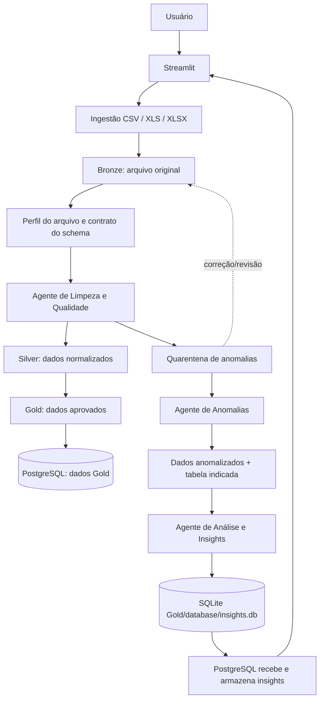
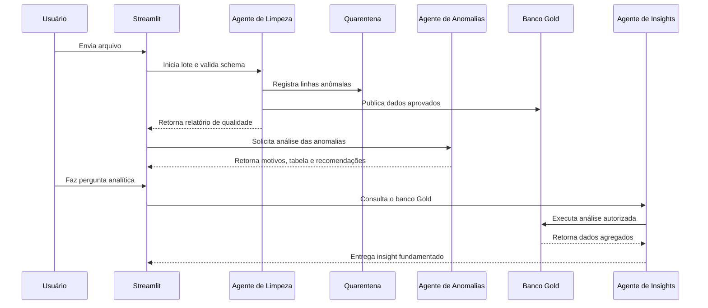

# Data Quality & Insight Platform

## Plataforma de ingestão, qualidade e análise inteligente de dados

Este projeto começou como um pipeline de arquivos CSV e Excel para SQLite. A nova proposta amplia seu objetivo: transformar o pipeline em uma **plataforma local de qualidade e inteligência de dados**, capaz de receber arquivos, limpar e validar registros, identificar anomalias, gerar um SQLite de insights e permitir que o PostgreSQL consuma esse arquivo posteriormente.

O fluxo continua baseado na arquitetura **Medalhão — Bronze, Silver e Gold** —, mas agora possui dois agentes principais e um componente especializado de qualidade:

| Componente | Responsabilidade |
| --- | --- |
| **Agente de Limpeza e Qualidade** | Padroniza colunas, corrige problemas determinísticos, valida tipos, aplica regras de qualidade e encaminha registros problemáticos para a quarentena. |
| **Agente de Anomalias** | Analisa registros suspeitos, explica as regras violadas, informa a tabela de origem e produz uma versão rastreável dos dados anômalos para revisão ou reprocessamento. |
| **Agente de Análise e Insights** | Recebe os dados anomalizados produzidos pelo Agente de Anomalias, identifica padrões, tendências e indicadores, gera o SQLite `insights.db` e disponibiliza o resultado para consumo posterior do PostgreSQL. |

> O agente de qualidade decide sobre a qualidade do dado. O agente de anomalias prepara os dados anomalizados, e o agente de insights interpreta exclusivamente essa entrada estruturada. O PostgreSQL recebe o banco SQLite gerado ao final.

## Objetivo do projeto

O objetivo não é apenas converter arquivos em tabelas. O objetivo é persistir o histórico operacional, os dados aprovados e os resultados analíticos em uma base consultável. O objetivo é criar um ciclo completo:

> **Receber → preservar → limpar → validar → separar anomalias → publicar dados aprovados → analisar → explicar insights.**

A plataforma deve responder a três perguntas fundamentais:

1. **O dado recebido pode ser utilizado?**

1. **Quais registros apresentam problemas e em qual tabela deveriam estar?**

1. **O que os dados aprovados indicam sobre o negócio?**

## Arquitetura geral



## Camadas de dados

| Camada | Objetivo | Pode ser consumida pelo agente de insights? |
| --- | --- | --- |
| **Bronze** | Preservar o arquivo exatamente como recebido, incluindo dados misturados, nulos e possíveis erros. | Não. Serve como fonte de auditoria e reprocessamento. |
| **Silver** | Normalizar nomes, formatos e tipos; registrar o resultado das regras de qualidade sem esconder a origem dos problemas. | Apenas para análises de qualidade, não para indicadores oficiais. |
| **Quarentena** | Armazenar registros anômalos, motivos, regras violadas, severidade, lote e status de tratamento. | Não por padrão. Pode ser consultada em uma tela específica de qualidade. |
| **Gold** | Conter somente dados aprovados ou explicitamente aceitos com alerta, prontos para consumo analítico. | Sim. É a fonte oficial do agente de insights; o agente gera o SQLite `insights.db` a partir dessa camada. |

O fato de um arquivo conter colunas ou registros misturados não é um problema da Bronze. A Bronze deve preservar o original. A classificação ocorre durante a transformação para Silver, e a decisão de publicação ocorre antes do Gold.

## Agente de Limpeza e Qualidade

O Agente de Limpeza e Qualidade é responsável pelas regras determinísticas e reproduzíveis. Ele não deve depender exclusivamente de texto gerado por um modelo de linguagem para aprovar ou rejeitar dados.

Suas tarefas incluem padronizar nomes de colunas, remover espaços indevidos, converter tipos, identificar nulos, validar domínios permitidos, conferir chaves, verificar duplicidades e aplicar regras de consistência de negócio. Cada ocorrência deve gerar um registro estruturado com código da regra, severidade, coluna, linha, valor observado e recomendação.

Exemplos de regras para o domínio de compras:

| Código | Regra | Severidade inicial |
| --- | --- | --- |
| `STRUCT_001` | As colunas obrigatórias existem. | Crítica |
| `TYPE_001` | Quantidade, preço, desconto e valor total são numéricos. | Crítica |
| `BUSINESS_001` | O valor total é compatível com quantidade, preço e desconto. | Crítica |
| `BUSINESS_002` | A quantidade é maior que zero. | Crítica |
| `BUSINESS_003` | O desconto está entre 0 e 100. | Crítica |
| `DOMAIN_001` | Canal, pagamento e indicadores possuem valores permitidos. | Erro |
| `DUP_001` | O identificador da compra não se repete no mesmo lote. | Crítica |
| `BUSINESS_004` | Relações entre idade e tempo de cliente são avaliadas. | Alerta |

O agente deve separar **erro**, **alerta** e **anomalia exploratória**. Uma combinação incomum não deve ser automaticamente excluída sem uma regra de negócio que justifique a rejeição.

## Agente de Anomalias

O Agente de Anomalias recebe os registros enviados para a quarentena e produz uma visão compreensível do problema. A saída esperada não é apenas uma mensagem genérica como “linha inválida”. Ela deve indicar:

| Informação | Exemplo |
| --- | --- |
| `batch_id` | `2026-08-12-001` |
| `record_id` | `linha_000127` |
| `source_file` | `vendas_agosto.csv` |
| `source_table` | `fato_compras` |
| `rule_code` | `BUSINESS_001` |
| `severity` | `critical`, `error` ou `warning` |
| `observed_value` | Valor total encontrado no arquivo |
| `expected_value` | Valor calculado pela regra |
| `recommended_action` | Corrigir, revisar, aceitar com alerta ou rejeitar |
| `anomaly_table` | Nome da tabela de quarentena onde o registro foi gravado |

A “versão anomalizada” deve ser entendida como uma **versão dos dados que preserva os registros problemáticos e adiciona metadados de qualidade**. Ela não deve substituir a Bronze, a Silver aprovada ou o Gold.

O agente pode gerar explicações em linguagem natural, mas sua decisão deve permanecer vinculada às regras estruturadas. Correções automáticas só devem ocorrer quando forem determinísticas, como remover espaços extras ou normalizar um separador decimal conhecido.

## Banco final e tabelas de qualidade

A proposta mantém o **PostgreSQL como banco de destino dos dados Gold**, executado localmente por Docker. O Agente de Análise e Insights não grava diretamente no PostgreSQL: ele gera o arquivo SQLite `medallion/gold/database/insights.db`. Em uma etapa posterior, uma skill de integração lê esse SQLite e importa suas tabelas para o PostgreSQL. Dessa forma, o SQLite funciona como artefato intermediário reproduzível e o PostgreSQL como banco consumidor.

| Banco ou tabela | Conteúdo |
| --- | --- |
| PostgreSQL / schema `gold` | Dados aprovados e tipados para consumo analítico. |
| PostgreSQL / schema `quality` | Registros em quarentena, achados, severidade e status de tratamento. |
| `pipeline_runs` | Histórico dos lotes e estados de processamento. |
| `quality_findings` | Uma ocorrência por regra violada, com severidade e status. |
| `anomaly_reports` | Resumos produzidos pelo Agente de Anomalias. |
| `medallion/gold/database/insights.db` | SQLite gerado pelo Agente de Insights a partir dos dados anomalizados, contendo tabela de origem, achados, métricas, resposta, escopo, data e versão do agente. |

Cada registro deve possuir `batch_id` e `record_id`. Isso permite responder de onde o dado veio, qual regra falhou, quem analisou o problema, se ele foi corrigido e se foi reprocessado.

## Agente de Análise e Insights

O Agente de Análise e Insights recebe como entrada principal os **dados anomalizados** produzidos pelo Agente de Anomalias. Esses dados devem conter os registros suspeitos, a tabela de origem, regras violadas, severidade e demais metadados necessários para análise. O agente pode calcular métricas, comparar padrões, identificar recorrências e gerar explicações. Depois de produzir a análise, ele cria o banco SQLite `medallion/gold/database/insights.db`. O PostgreSQL não é escrito diretamente pelo agente; ele recebe esse SQLite em uma etapa posterior e armazena seus registros.

A interface Streamlit deve apresentar os insights com transparência. Cada resposta precisa informar a tabela de origem dos dados anomalizados, as colunas utilizadas, o período analisado, as métricas calculadas e, quando possível, uma visualização ou tabela de apoio. O texto, a tabela analisada, os filtros e os resultados resumidos são persistidos primeiro no SQLite `insights.db`; depois, o PostgreSQL recebe e armazena essa estrutura para consulta centralizada.

O agente não deve inventar métricas nem consultar tabelas de quarentena silenciosamente. Caso o usuário queira analisar anomalias, isso deve ocorrer em uma seção explícita de **Qualidade e Anomalias**, separada da seção de **Insights do negócio**.

Exemplos de entregas no Streamlit:

| Área da interface | Entrega |
| --- | --- |
| **Ingestão** | Upload, prévia e identificação do lote. |
| **Qualidade** | Percentual de linhas aprovadas, alertas, rejeições e principais regras violadas. |
| **Anomalias** | Tabela indicada, registros anomalizados, motivo e recomendação. |
| **Dados aprovados** | Consulta às tabelas Gold e indicadores básicos. |
| **Insights** | Pergunta em linguagem natural, resposta explicada, métricas e gráficos. |
| **Histórico** | Execuções, versões, reprocessamentos e relatórios anteriores. |

## Fluxo recomendado no Streamlit

O Streamlit deixa de ser apenas uma tela de upload e passa a ser o centro de operação da plataforma.



## Mudança de posicionamento

O nome e a descrição do projeto devem deixar de enfatizar apenas “CSV para DB”. A nova descrição recomendada é:

> **Plataforma local de qualidade e análise inteligente de dados que ingere arquivos tabulares, preserva a origem, normaliza registros, identifica anomalias, publica dados aprovados em PostgreSQL executado via Docker e gera um SQLite de insights que pode ser consumido pelo PostgreSQL e visualizado no Streamlit.**

O projeto ainda é um pipeline de dados, mas agora possui valor de portfólio em três áreas: engenharia de dados, qualidade de dados e análise assistida por agente.

## Limites importantes da proposta

A proposta é forte, mas deve ser implementada com uma separação clara entre automação confiável e geração probabilística. O agente de limpeza deve começar com funções e regras testáveis. O agente de anomalias pode usar inteligência artificial para explicar e priorizar achados, desde que não altere dados sem rastreabilidade. O agente de insights deve gerar respostas baseadas em consultas, métricas e tabelas reais do banco.

Não é recomendável começar com três agentes autônomos conversando livremente. Para a primeira versão, prefira um orquestrador simples que execute etapas com contratos definidos: limpeza produz dados e findings; anomalias produz relatório; análise produz insights citando a origem.

## Estrutura proposta do projeto

```
ETL_PIPELINE/
├── agents/
│   ├── cleaning_agent.py
│   ├── anomaly_agent.py
│   ├── insight_agent.py
│   └── orchestrator.py
├── quality/
│   ├── rules.py
│   ├── schemas.py
│   ├── quarantine.py
│   └── reports.py
├── docker-compose.yml
├── medallion/
│   ├── bronze/
│   ├── silver/
│   ├── quarantine/
│   └── gold/
│       └── database/
├── eda/
│   └── .eda_ETl.py
└── streamlit/
    └── app.py
```

A estrutura acima é uma direção arquitetural. A implementação pode ser incremental, sem exigir a criação de todos os agentes na primeira etapa.

## Roadmap de implementação

| Fase | Entrega |
| --- | --- |
| **Fase 1** | Corrigir o modelo de qualidade: `batch_id`, `record_id`, códigos de regra, severidade e status. |
| **Fase 2** | Criar a tela Streamlit de qualidade e anomalias. |
| **Fase 3** | Implementar o Agente de Anomalias como gerador de explicações e recomendações. |
| **Fase 4** | Criar o Agente de Insights para consultas e métricas do Gold. |
| **Fase 5** | Adicionar histórico de relatórios, reprocessamento e avaliação da qualidade das respostas. |

## Persistência PostgreSQL via Docker

A camada Gold possui dois destinos lógicos: as tabelas Gold aprovadas e o arquivo SQLite `insights.db`, gerado pelo Agente de Insights a partir dos dados anomalizados. O PostgreSQL é executado via Docker e recebe o `insights.db` por uma rotina posterior de ingestão. O SQLAlchemy ou outro adaptador de carga realiza essa importação; o agente continua desacoplado do PostgreSQL.

O PostgreSQL é executado via Docker e funciona como consumidor dos dados Gold e, principalmente, do banco SQLite `insights.db` gerado pelo Agente de Insights. Esse SQLite contém obrigatoriamente o nome da tabela de origem dos dados anomalizados, os achados, métricas e insights coletados. Uma rotina separada recebe o arquivo e armazena seus registros no PostgreSQL. A configuração Docker está disponível em `docker-compose.yml`; a integração completa de importação é uma etapa de implementação do roadmap.

A separação lógica recomendada é:

| Estrutura | Responsabilidade |
| --- | --- |
| PostgreSQL `gold` | Tabelas aprovadas para consumo analítico. |
| SQLite `insights.db` | Artefato intermediário gerado pelo Agente de Insights. |
| PostgreSQL `quality` | Execuções, regras, findings, quarentena e decisões dos agentes, quando essa importação for implementada. |
| PostgreSQL `metadata` | Lotes, arquivos, hashes, versões de schema e auditoria. |

A tabela `insight_reports` do SQLite `insights.db` deve possuir, no mínimo, a seguinte estrutura conceitual:

| Campo | Conteúdo |
| --- | --- |
| `insight_id` | Identificador único do insight. |
| `source_table` | Nome da tabela Gold analisada. |
| `source_database` | Banco ou conexão de origem dos dados analisados. |
| `question` | Pergunta ou objetivo da análise. |
| `insight_text` | Insight gerado em linguagem natural. |
| `metrics_json` | Métricas e valores que sustentam o insight. |
| `query_text` | Consulta ou plano de consulta utilizado, quando aplicável. |
| `filters_json` | Filtros e período considerados. |
| `created_at` | Data e hora da geração. |
| `agent_version` | Versão do agente responsável pela análise. |

Assim, para cada análise, o Streamlit consegue exibir **qual tabela foi analisada, quais filtros foram usados, quais métricas foram encontradas e qual insight foi produzido**.

O fluxo de persistência é: **arquivo Bronze → limpeza → quarentena → Agente de Anomalias → dados anomalizados → Agente de Insights → SQLite ****`insights.db`**** → PostgreSQL → Streamlit**. O Streamlit pode apresentar o SQLite durante o desenvolvimento ou consultar o PostgreSQL depois que o banco for recebido e armazenado.

## Como executar

### Instalação

```bash
pip install -r requirements.txt
```

### Subir o PostgreSQL com Docker

```bash
docker compose up -d postgres
```

O arquivo `docker-compose.yml` incluído neste projeto sobe o serviço `postgres` com volume persistente. A configuração usa variáveis de ambiente, como `POSTGRES_DB`, `POSTGRES_USER`, `POSTGRES_PASSWORD`, `POSTGRES_PORT` e `DATABASE_URL`. O arquivo `.env` não deve ser versionado. Os valores padrão do Compose são apenas para desenvolvimento local.

### Verificar o PostgreSQL

```bash
docker compose ps
docker compose logs postgres
```

### Interface Streamlit

```bash
streamlit run ETL_PIPELINE/streamlit/app.py
```

### Execução do pipeline

```bash
python ETL_PIPELINE/eda/.eda_ETl.py
```

## Estado atual e próximos passos

A implementação atual realiza ingestão, transformação Silver, tipagem Gold, carga local e armazenamento básico de anomalias. A evolução arquitetural proposta adiciona o Agente de Anomalias, que produz os dados anomalizados, e o Agente de Insights, que recebe esses dados e gera o SQLite `insights.db`. O PostgreSQL via Docker recebe e armazena esse SQLite. A interface Streamlit ainda está centrada no upload e na confirmação do nome da tabela. O próximo passo prioritário é gerar o `insights.db` a partir dos dados anomalizados e criar o consumidor PostgreSQL.

Depois disso, o Agente de Anomalias pode explicar os achados e indicar a tabela de quarentena. Somente após o banco Gold estar estável e consultável deve ser implementado o Agente de Insights.