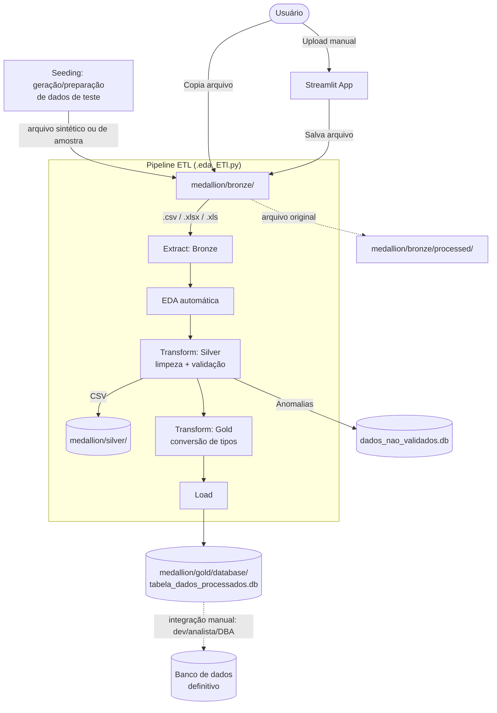

# ETL (PIPELINE DE ARQUIVOS XLS,CSV PARA SQLITE, VOLTADO À INTEGRAÇÃO COM UM BANCO DE DADOS) 📊🗃️

**É um pipeline de ingestão de dados que recebe arquivos CSV e Excel, aplica limpeza, validação e tipagem automática, e carrega o resultado em um banco SQLite — uma tabela por arquivo processado.** O escopo do projeto termina aqui: ele entrega um SQLite limpo, validado e tipado, pronto para ser **integrado** a um banco de dados definitivo.

**A modelagem do banco de destino, a estratégia de integração (migração, réplica, ETL adicional, etc.) e as decisões de schema relacional são responsabilidade de quem for trabalhar com esse dado a partir daqui — desenvolvedor backend, analista de dados ou DBA.** Este projeto não define, nem pretende definir, como esse banco final deve ser modelado; ele apenas entrega dados prontos para consumo.

O projeto segue a arquitetura **Medalhão (Seeding → Bronze / Silver / Gold)**, com **Python**, **Pandas**, **Streamlit** e **SQLAlchemy** — este último atuando como camada de apoio à persistência, abstraindo a escrita no SQLite e facilitando uma futura troca de engine sem reescrever a lógica de carga.

---

## 🏗️ Arquitetura (Medalhão)



---

## 📂 Estrutura do Projeto

| Diretório / Arquivo | Descrição | Tecnologia |
| :--- | :--- | :--- |
| `ETL_PIPELINE/medallion/seeding/` | Camada Seeding — geração ou preparação de dados de teste/amostra, **anterior à Bronze**, usada para popular o pipeline antes da ingestão de dados reais | Python / Faker (planejado) |
| `ETL_PIPELINE/medallion/bronze/` | Camada Bronze — arquivos originais (reais ou vindos do seeding) aguardando processamento | — |
| `ETL_PIPELINE/medallion/bronze/processed/` | Arquivos já processados, movidos automaticamente | — |
| `ETL_PIPELINE/medallion/silver/` | CSVs com limpeza estrutural e validação (`*_silver.csv`) | Pandas |
| `ETL_PIPELINE/medallion/gold/` | CSVs com tipos finais (`*_gold.csv`), prontos para carga no banco relacional | Pandas |
| `ETL_PIPELINE/medallion/gold/database/tabela_dados_processados.db` | Banco principal — uma tabela por arquivo processado, pronto para integração externa | SQLite |
| `ETL_PIPELINE/medallion/gold/database/dados_nao_validados.db` | Banco de anomalias — linhas rejeitadas, acumulando | SQLite |
| `ETL_PIPELINE/eda/.eda_ETl.py` | Lógica do pipeline: extract, EDA, transform silver/gold, load (via SQLAlchemy), validação | Python 3 / SQLAlchemy |
| `ETL_PIPELINE/streamlit/app.py` | Interface web para upload manual de arquivos | Streamlit |
| `README.md` | Documentação do projeto | — |

---

## 🚀 Como Rodar Localmente

### Pré-requisitos
* Python 3.10+
* pip

### 1. Instalar dependências
```bash
pip install -r requirements.txt
```

### 2. Rodar via interface web (Streamlit)
```bash
streamlit run ETL_PIPELINE/streamlit/app.py
```

### 3. Rodar via terminal (apenas ETL)
```bash
python ETL_PIPELINE/eda/.eda_ETl.py
```

---

## ⚙️ Como o Pipeline Funciona

O pipeline foi desenhado de ponta a ponta pensando na carga final em um banco de dados relacional: cada camada existe para deixar o dado cada vez mais próximo do formato que uma tabela relacional exige (schema definido, tipos corretos, sem duplicidade, sem nulos inesperados).

### Seeding (Pré-Bronze)
- Camada **anterior à Bronze**, usada para gerar ou preparar dados de teste/amostra antes da chegada de dados reais
- Objetivo: permitir validar o pipeline e o schema do banco de dados relacional sem depender de arquivos reais
- Pode gerar arquivos sintéticos (ex.: com Faker) ou apenas selecionar/anonimizar amostras de arquivos existentes
- O resultado da camada de Seeding é depositado em `medallion/bronze/`, seguindo o mesmo fluxo de um arquivo real — o pipeline não diferencia a origem

### Bronze (Extract)
- Lê arquivos **CSV** (tentando `;` e depois `,`) e **Excel** (`.xlsx` / `.xls`)
- Sem nenhuma transformação — dado bruto, como veio (seja de origem real ou de seeding)

### Silver (Transform + Validação)
- Padroniza nomes de colunas (minúsculas, sem caracteres especiais)
- Remove linhas **duplicadas**
- Remove linhas com **valores nulos** (exceto e-mail vazio, que vira anomalia `ausente`)
- Remove espaços em branco no início/fim dos textos
- **Valida e-mails**: válido → mantém | inválido → `invalido` | vazio → `ausente`
- **Valida CPF e CNPJ** (dígitos verificadores)
- Linhas com qualquer anomalia são separadas com `motivo_rejeicao` e vão para `dados_nao_validados.db`

### Gold (Tipagem)
- Converte automaticamente colunas para o tipo real: **booleano** (Sim/Não, Yes/No), **número** (com vírgula decimal) e **data**
- Gera o `*_gold.csv` pronto para consumo — já no formato esperado por um schema relacional

### Load (Persistência via SQLAlchemy)
- A escrita no banco é feita através do **SQLAlchemy**, que atua como camada de apoio à persistência entre o pipeline e o SQLite — o pipeline não executa SQL cru, ele usa o SQLAlchemy como intermediário (engine + conexão)
- Grava a tabela no banco principal `tabela_dados_processados.db`
- **Não substitui tabela existente**: se a tabela já existe, o pipeline é **rejeitado** — é preciso escolher outro nome
- Por o SQLAlchemy abstrair o dialeto do banco, trocar o SQLite por outra engine relacional no futuro (ex.: PostgreSQL) tende a exigir pouca ou nenhuma mudança na lógica de carga — mas essa troca **não faz parte do escopo deste pipeline**
- A partir daqui, o dado está pronto para ser consumido e integrado ao banco definitivo por quem for responsável por essa etapa (dev backend, analista ou DBA)

### Banco de Anomalias
- Toda linha rejeitada na validação é **acumulada** em `dados_nao_validados.db` (tabela `dados_nao_validados`), com o motivo de cada rejeição

---

## 🔢 Regras do Nome da Tabela

Regras aplicadas na validação do nome da tabela (centradas em `validar_nome_tabela`):

- Apenas letras minúsculas (a-z)
- Números (0-9) permitidos
- `_` (underscore) permitido
- Deve começar com **letra**
- Sem espaços
- Sem acentos
- Sem caracteres especiais (`-`, `.`, `/`, `@`, etc.)
- Limite de **63 caracteres**
- Palavras reservadas do SQL não são permitidas
- A tabela deve **existir** para ser gravada — duplicidade rejeita o pipeline

**Exemplos válidos:** `vendas`, `clientes`, `vendas_2026`, `clientes_sp`, `produtos_2026`
**Exemplos inválidos:** `123vendas`, `vendas janeiro`, `vendas-janeiro`, `vendas.janeiro`, `vendas@2026`, `vendas_áudio`

O Streamlit **sanitiza o nome automaticamente enquanto o usuário digita**, aplicando essas regras em tempo real.

---

## 🖥️ Interface Streamlit

- Envia um arquivo **CSV ou Excel** (real ou vindo da camada de Seeding) e mostra uma **prévia** dos dados
- Abre um popup para **confirmar/alterar o nome da tabela** (validado em tempo real)
- Ao confirmar, **ativa o pipeline** (seeding opcional → bronze → silver → gold → banco relacional)
- O Streamlit **não consulta o banco de dados**: apenas envia o arquivo e o nome da tabela para o pipeline; se o pipeline rejeitar (ex.: tabela duplicada), o erro é exibido em vermelho

---

## 🤝 Responsabilidade de Integração

Este pipeline **não inclui API, autenticação, nem definição de schema do banco final**. O SQLAlchemy usado aqui serve apenas como camada de apoio à **persistência interna do pipeline** (escrever no SQLite) — ele não define modelos de domínio, não expõe endpoints e não modela o banco de destino. Ele entrega um arquivo SQLite validado e tipado — o que acontece depois é responsabilidade de quem for consumir esse dado:

*   **Desenvolvedor Backend**: decide como o dado do SQLite será lido, transformado em modelos de aplicação e exposto (API própria, job de sincronização, etc.), fora do escopo deste repositório.
*   **Analista de Dados**: usa o SQLite como fonte para análises, dashboards ou cargas em ferramentas de BI.
*   **DBA**: define a modelagem do banco de dados definitivo (relacional ou não), estratégia de migração/replicação do SQLite para esse banco, índices, constraints e política de versionamento de schema.

O pipeline garante apenas que o dado que chega até essas pessoas está **limpo, validado e tipado** — não garante nada sobre como ele deve ser modelado no destino final.

---

## 📝 Notas de Desenvolvimento

*   **Escopo do pipeline**: vai do arquivo bruto (CSV/Excel) até um SQLite validado e tipado. Não há API, autenticação ou definição de banco definitivo neste repositório.
*   **Seeding como camada de apoio**: útil para testes de schema e de carga sem exigir dados reais logo de início; não é uma etapa obrigatória do fluxo de produção.
*   **Reprocessamento**: tabela duplicada → pipeline **rejeitado** (sem substituição). Use um nome diferente ou mova o arquivo de volta da `processed/` para a `bronze/`.
*   **Camadas em disco**: `medallion/silver/` e `medallion/gold/` guardam CSVs intermediários para depuração.
*   **Anomalias**: `dados_nao_validados.db` acumula as linhas rejeitadas com o motivo — útil para auditoria de qualidade de dados.
*   **Streamlit e terminal compartilham a mesma função** (`processar_arquivo`).

---

## 🌍 Ambientes

**Status atual: um único ambiente, local.** Não existem ambientes separados de staging/produção, branch protection, nem state remoto — o projeto roda inteiro na máquina de quem executa, sem distinção de ambiente.

| Ambiente | Branch | Onde roda | Trigger |
|:--|:--|:--|:--|
| **Local (único existente)** | qualquer | Máquina do usuário | Execução manual |
| ~~Staging~~ | — | — | Não existe |
| ~~Produção~~ | — | — | Não existe |

---

## 🔒 Segurança e regras

O escopo de segurança deste projeto é o do próprio pipeline local — autenticação, controle de acesso e criptografia em trânsito são responsabilidade de quem for integrar o SQLite resultante a um sistema maior.

*   **Tabela duplicada**: o pipeline **rejeita** a inserção se a tabela já existir — o usuário deve informar um nome alternativo para não substituir dados.
*   **Dados de Seeding**: se gerados sinteticamente, não representam dados sensíveis reais; se derivados de amostras reais, devem ser anonimizados antes de entrar na Bronze.
*   **Todo CSV/Excel é tratado no pipeline para virar dado consumível**: tanto no formato quanto em valores duplicados e anomalias.
*   **O FRONT (STREAMLIT) NÃO SABE QUEM É O BANCO**: apenas envia o arquivo para o pipeline.
*   **Sem gestão de credenciais externas**: o projeto não expõe nem consome serviços externos — não há `.env` de produção, JWT ou segredos a gerenciar neste escopo.

> ⚠️ Se este projeto vier a lidar com dados sensíveis de verdade (dados pessoais, de saúde, financeiros), isso precisa ser resolvido — pela equipe responsável pela integração — antes de qualquer uso além de teste local.

---

## 📊 Observabilidade

**Status atual: `print()` no console.** Não há CloudWatch, dashboards ou métricas — cada etapa do pipeline (`[SEEDING]`, `[BRONZE]`, `[SILVER]`, `[GOLD]`, `[LOAD]`, `[NAO_VALIDADOS]`) imprime seu progresso diretamente no terminal (ou no log do processo Streamlit) enquanto roda.

Melhorias futuras de observabilidade (logging estruturado, métricas) ficam a critério de quem for operar o pipeline em um contexto maior — não fazem parte do escopo atual deste repositório.

---

## 🔄 Rollback

**Status atual: manual, via arquivos.**

*   **Banco**: como cada tabela é recriada do zero a cada processamento, o "rollback" é reprocessar o arquivo original — ele já foi movido para `medallion/bronze/processed/`, então basta movê-lo de volta para `medallion/bronze/` e rodar o pipeline de novo.
*   **Camadas intermediárias**: os CSVs em `medallion/silver/` e `medallion/gold/` continuam no disco, permitindo inspecionar ou reimportar manualmente.
*   **Seeding**: pode ser reexecutado a qualquer momento para gerar uma nova massa de teste, sem impacto nos dados reais já carregados no SQLite.
*   Não existe backup automático do `.db`, nem versionamento de schema.
*   Estratégias mais robustas de backup, restauração e versionamento de schema (ex.: Alembic) são decisão de quem for integrar o dado ao banco definitivo — fora do escopo deste pipeline.

---

## 🗺️ PLANEJAMENTO

- [FALTA FAZER] **Camada de Seeding automatizada** (ex.: com Faker) integrada ao pipeline
- [FALTA FAZER] **Orquestração (Airflow)** substituindo a execução manual
- [FALTA FAZER] **Workflows de CI/CD** reais para o pipeline
- [FAZER] Melhorar detecção de números com separador de milhar
- [FAZER] Expandir validação brasileira (telefone, CEP, datas, etc.)

> A modelagem do banco de destino, migração de dados e qualquer camada de acesso (API, ORM de aplicação, etc.) ficam fora deste planejamento — são responsabilidade de quem for integrar o SQLite gerado a um sistema maior (dev backend, analista ou DBA).