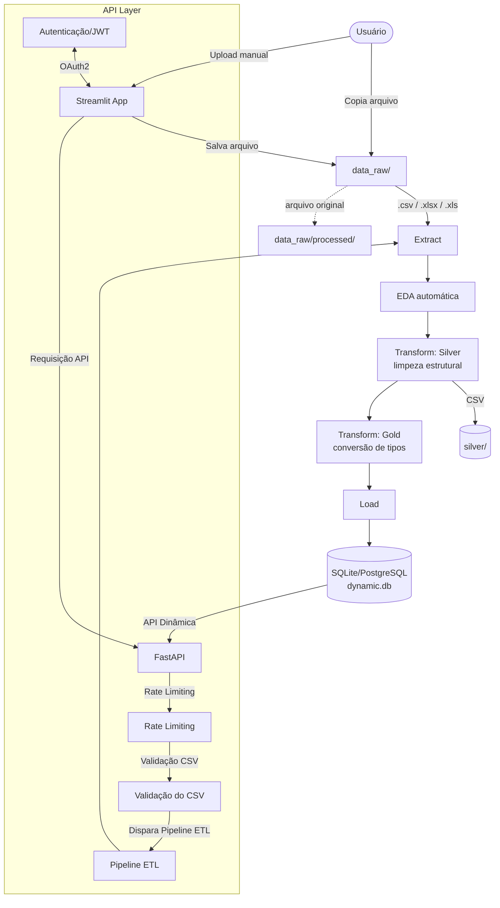

# ETL+DESENVOLVIMENTO DE API(PROJETO MISTURANDO CONHECIMENTOS DE DESENVOLVIMENTO BACK-END E ENG DE DADOS 📊🗃️

**é sistema de ingestão de dados que recebe arquivos **CSV e Excel** de origens variadas, aplica limpeza e tipagem automática, e carrega os resultados em um banco **SQLite** — uma tabela por arquivo processado. O projeto segue a arquitetura **Bronze / Silver / Gold**, com **Python**, **Pandas**, **SQLAlchemy** e **Streamlit**.

---

## 🏗️ Arquitetura



---

## 📂 Estrutura do Projeto

| Diretório / Arquivo | Descrição | Tecnologia |
| :--- | :--- | :--- |
| `data_raw/` | Entrada bronze — arquivos originais aguardando processamento | — |
| `data_raw/processed/` | Arquivos já processados, movidos automaticamente | — |
| `silver/` | CSVs com limpeza estrutural | Pandas |
| `gold/` | CSVs com tipos finais, prontos para o banco | Pandas |
| `database/dynamic.db` | Banco SQLite único, uma tabela por arquivo processado | SQLite |
| `src/etl_generic.py` | Lógica do pipeline: extract, EDA, transform, load | Python 3 |
| `src/app.py` | Interface web para upload manual de arquivos | Streamlit |
| `src/api/` | Módulos da API FastAPI | FastAPI, Pydantic, SQLAlchemy, etc. |
| `requirements.txt` | Dependências do projeto | pip |
| `.env` | Variáveis de ambiente | — |
| `Dockerfile` | Definição do ambiente Docker | Docker |
| `docker-compose.yml` | Orquestração de serviços Docker | Docker Compose |

---

## 🚀 Como Rodar Localmente

### Pré-requisitos
* Python 3.10+
* pip
* Docker e Docker Compose (para a API e PostgreSQL)

### 1. Instalar dependências
```bash
pip install -r requirements.txt
```

### 2. Configurar variáveis de ambiente
Crie um arquivo `.env` na raiz do projeto com as seguintes variáveis (exemplo):
```dotenv
DATABASE_URL="postgresql://user:password@db:5432/mydatabase"
SECRET_KEY="sua_chave_secreta_jwt"
ALGORITHM="HS256"
ACCESS_TOKEN_EXPIRE_MINUTES=30
```

### 3. Iniciar serviços Docker (API e PostgreSQL)
```bash
docker-compose up --build -d
```

### 4. Rodar via terminal (apenas ETL)
```bash
python src/etl_generic.py
```

### 5. Rodar via interface web (Streamlit)
```bash
streamlit run src/app.py
```

---

## 🛠️ Deployment (CI/CD)

**Status atual: manual, local.** Não existe pipeline de deploy automatizado neste projeto — a execução acontece via terminal ou Streamlit, na própria máquina, sem publicação em nuvem.

Não há GitHub Actions, Docker, ECR, ECS ou Terraform configurados. A tabela de workflows abaixo (seção CI/CD) descreve o que está **planejado**, não o que está em produção.

---

## 🔌 API

**Status atual: Planejada e em desenvolvimento.** A API será construída com **FastAPI** para oferecer endpoints robustos e de alta performance para interagir com os dados processados e disparar o pipeline ETL. A segurança será garantida por **JWT/OAuth2**, a validação de dados por **Pydantic**, a persistência por **SQLAlchemy** com **PostgreSQL**, e a contenção em **Docker**.

### Componentes da API:

*   **FastAPI**: Um framework web moderno e rápido para construir APIs com Python 3.7+ baseado em tipagem padrão do Python. Oferece documentação interativa automática (Swagger UI/ReDoc).
*   **Pydantic**: Utilizado para validação de dados e serialização/desserialização. Garante que os dados de entrada e saída da API estejam em conformidade com os modelos definidos, melhorando a robustez e a segurança.
*   **JWT/OAuth2**: Implementação de autenticação e autorização. Os usuários se autenticarão para obter um JSON Web Token (JWT), que será usado para acessar rotas protegidas da API. O OAuth2 fornece o framework para a autenticação baseada em tokens.
*   **SQLAlchemy**: Um ORM (Object Relational Mapper) e toolkit SQL para Python. Será usado para interagir com o banco de dados PostgreSQL de forma eficiente e segura, abstraindo as operações SQL diretas.
*   **PostgreSQL**: Um sistema de gerenciamento de banco de dados relacional objeto-relacional poderoso, de código aberto e altamente extensível. Será o banco de dados principal para armazenar os dados processados pelo pipeline ETL, substituindo ou complementando o SQLite.
*   **.env**: Um arquivo para gerenciar variáveis de ambiente, como credenciais de banco de dados, chaves secretas para JWT e outras configurações sensíveis, mantendo-as fora do controle de versão.
*   **HTTPS**: A comunicação com a API será protegida por HTTPS para garantir a criptografia dos dados em trânsito, protegendo contra interceptação e ataques man-in-the-middle. Isso será configurado no ambiente Docker, possivelmente com um proxy reverso como Nginx.
*   **Rate Limiting**: Implementado para proteger a API contra abusos e ataques de negação de serviço (DoS). Limitará o número de requisições que um cliente pode fazer em um determinado período, garantindo a disponibilidade do serviço. Bibliotecas como `fastapi-limiter` ou `SlowAPI` podem ser utilizadas [7, 8, 9, 10].
*   **Pytest**: Framework de testes robusto para Python. Serão desenvolvidos testes unitários e de integração para a API, garantindo a correção do código, a segurança dos endpoints e a funcionalidade do pipeline ETL.
*   **Docker**: A API, o PostgreSQL e, potencialmente, o Streamlit serão conteinerizados usando Docker. Isso garante um ambiente de desenvolvimento e produção consistente, facilitando o deploy e a escalabilidade.

### Endpoints Planejados:

*   `/auth/token`: Endpoint para autenticação e obtenção de JWT.
*   `/etl/upload`: Recebe arquivos CSV/Excel e dispara o pipeline ETL.
*   `/data/{table_name}`: API dinâmica para CRUD completo em tabelas específicas do banco de dados.
*   `/data/{table_name}/{id}`: Acesso a registros específicos.

---

## 📝 Notas de Desenvolvimento

*   **Reprocessamento**: mesmo nome de arquivo → tabela é **substituída** (`if_exists="replace"`), não soma dados.
*   **Camadas em disco**: `silver/` e `gold/` guardam CSVs intermediários para depuração.
*   **Streamlit e terminal compartilham a mesma função** (`processar_arquivo`).

---

## 🌍 Ambientes

**Status atual: um único ambiente, local.** Não existem ambientes separados de staging/produção, branch protection, nem state remoto — o projeto roda inteiro na máquina de quem executa, sem distinção de ambiente.

| Ambiente | Branch | Onde roda | Trigger |
|:--|:--|:--|:--|
| **Local (único existente)** | qualquer | Máquina do usuário | Execução manual |
| ~~Staging~~ | — | — | Não existe |
| ~~Produção~~ | — | — | Não existe |

---

## 🔒 Segurança

Com a introdução da API e do PostgreSQL, a segurança se torna um aspecto crítico. As seguintes considerações são importantes:

*   **Credenciais Sensíveis**: As credenciais do PostgreSQL e a chave secreta do JWT serão gerenciadas via `.env` e, em produção, por um sistema de gerenciamento de segredos (ex: AWS Secrets Manager, HashiCorp Vault).
*   **Dados Sensíveis**: A criptografia de dados em repouso e em trânsito será implementada. Para dados em repouso no PostgreSQL, pode-se considerar a criptografia a nível de disco ou de coluna. Para dados em trânsito, o HTTPS é fundamental.
*   **Controle de Acesso**: A autenticação JWT/OAuth2 garantirá que apenas usuários autorizados possam acessar os endpoints da API. A autorização baseada em roles ou permissões pode ser adicionada para controle de acesso mais granular.
*   **Validação de Entrada**: O Pydantic garantirá que os dados recebidos pela API sejam válidos, prevenindo ataques de injeção e outros vetores de ataque baseados em dados malformados.
*   **Rate Limiting**: Proteção contra ataques de força bruta e negação de serviço.

> ⚠️ Se este projeto vier a lidar com dados sensíveis de verdade (dados pessoais, de saúde, financeiros), isso precisa ser resolvido antes de qualquer uso além de teste local.

---

## 📊 Observabilidade

**Status atual: `print()` no console.** Não há CloudWatch, dashboards ou métricas — cada etapa do pipeline (`[BRONZE]`, `[SILVER]`, `[GOLD]`, `[LOAD]`) imprime seu progresso diretamente no terminal (ou no log do processo Streamlit) enquanto roda.

Com a API, a observabilidade será aprimorada com:

*   **Logging Estruturado**: Utilização de bibliotecas de logging para registrar eventos da API e do pipeline, com níveis de severidade e formato estruturado (JSON) para facilitar a análise.
*   **Métricas**: Exposição de métricas de performance da API (tempo de resposta, taxa de erros, etc.) e do pipeline ETL (tempo de execução, número de registros processados) usando Prometheus e Grafana.
*   **Tracing Distribuído**: Para sistemas mais complexos, a implementação de tracing distribuído (ex: OpenTelemetry) pode ajudar a rastrear requisições através de múltiplos serviços.

---

## 🔄 Rollback

**Status atual: manual, via arquivos.**

*   **Banco**: como cada tabela é recriada do zero a cada processamento, o "rollback" hoje é reprocessar o CSV/Excel original — mas ele já foi movido para `data_raw/processed/`, então basta movê-lo de volta para `data_raw/` e rodar o pipeline de novo.
*   **Camadas intermediárias**: os CSVs em `silver/` e `gold/` continuam no disco após o processamento, então dá pra inspecionar ou reimportar manualmente sem refazer a limpeza do zero.
*   Não existe backup automático do `.db`, nem versionamento de schema.

Com o PostgreSQL, será possível implementar estratégias de backup e restauração mais robustas, além de versionamento de schema com ferramentas como Alembic.

---


## 🗺️ PLANEJAMENTO

- [FALTA FAZER] **API (FastAPI)** com rotas dinâmicas por tabela (CRUD completo)
- [FALTAR FAZER ] **Orquestração (Airflow)** substituindo a execução manual
- [FALTAR FAZER] **Migração para PostgreSQL**
- [FALTAR FAZER]**Workflows de CI/CD** reais (tabela acima)
- [ FAZER FAZER] Melhorar detecção de números com separador de milhar

---

