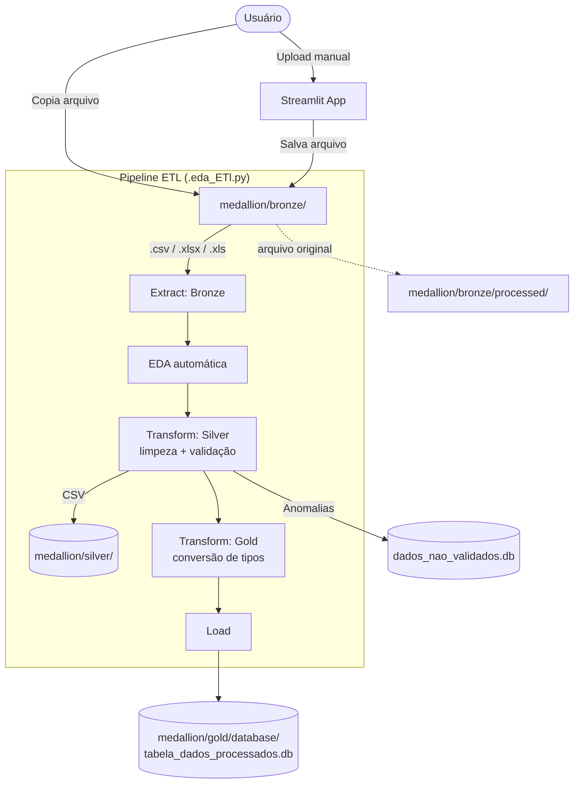

# ETL + DESENVOLVIMENTO DE API (PROJETO MISTURANDO BACK-END E ENGENHARIA DE DADOS) 📊🗃️

**É um sistema de ingestão de dados que recebe arquivos CSV e Excel de origens variadas, aplica limpeza, validação e tipagem automática, e carrega os resultados em um banco SQLite — uma tabela por arquivo processado.** O projeto segue a arquitetura **Medalhão (Bronze / Silver / Gold)**, com **Python**, **Pandas**, **SQLAlchemy** e **Streamlit**.

---

## 🏗️ Arquitetura (Medalhão)



---

## 📂 Estrutura do Projeto

| Diretório / Arquivo | Descrição | Tecnologia |
| :--- | :--- | :--- |
| `ETL_PIPELINE/medallion/bronze/` | Camada Bronze — arquivos originais aguardando processamento | — |
| `ETL_PIPELINE/medallion/bronze/processed/` | Arquivos já processados, movidos automaticamente | — |
| `ETL_PIPELINE/medallion/silver/` | CSVs com limpeza estrutural e validação (`*_silver.csv`) | Pandas |
| `ETL_PIPELINE/medallion/gold/` | CSVs com tipos finais (`*_gold.csv`) | Pandas |
| `ETL_PIPELINE/medallion/gold/database/tabela_dados_processados.db` | Banco principal — uma tabela por arquivo processado | SQLite |
| `ETL_PIPELINE/medallion/gold/database/dados_nao_validados.db` | Banco de anomalias — linhas rejeitadas, acumulando | SQLite |
| `ETL_PIPELINE/eda/.eda_ETl.py` | Lógica do pipeline: extract, EDA, transform silver/gold, load, validação | Python 3 |
| `ETL_PIPELINE/streamlit/app.py` | Interface web para upload manual de arquivos | Streamlit |
| `README.md` | Documentação do projeto | — |

---

## 🚀 Como Rodar Localmente

### Pré-requisitos
* Python 3.10+
* pip
* (Futuro) Docker e Docker Compose para a API e PostgreSQL

### 1. Instalar dependências
```bash
pip install -r requirements.txt
```

### 2. Rodar via interface web (Streamlit)
```bash
streamlit run ETL_PIPELINE/streamlit/app.py
```

### 3. Rodar via terminal (apenas ETL)
```bash
python ETL_PIPELINE/eda/.eda_ETl.py
```

---

## ⚙️ Como o Pipeline Funciona

### Bronze (Extract)
- Lê arquivos **CSV** (tentando `;` e depois `,`) e **Excel** (`.xlsx` / `.xls`)
- Sem nenhuma transformação — dado bruto, como veio

### Silver (Transform + Validação)
- Padroniza nomes de colunas (minúsculas, sem caracteres especiais)
- Remove linhas **duplicadas**
- Remove linhas com **valores nulos** (exceto e-mail vazio, que vira anomalia `ausente`)
- Remove espaços em branco no início/fim dos textos
- **Valida e-mails**: válido → mantém | inválido → `invalido` | vazio → `ausente`
- **Valida CPF e CNPJ** (dígitos verificadores)
- Linhas com qualquer anomalia são separadas com `motivo_rejeicao` e vão para `dados_nao_validados.db`

### Gold (Tipagem)
- Converte automaticamente colunas para o tipo real: **booleano** (Sim/Não, Yes/No), **número** (com vírgula decimal) e **data**
- Gera o `*_gold.csv` pronto para consumo

### Load
- Grava a tabela no banco principal `tabela_dados_processados.db`
- **Não substitui tabela existente**: se a tabela já existe, o pipeline é **rejeitado** — é preciso escolher outro nome

### Banco de Anomalias
- Toda linha rejeitada na validação é **acumulada** em `dados_nao_validados.db` (tabela `dados_nao_validados`), com o motivo de cada rejeição

---

## 🔢 Regras do Nome da Tabela

Regras aplicadas na validação do nome da tabela (centradas em `validar_nome_tabela`):

- Apenas letras minúsculas (a-z)
- Números (0-9) permitidos
- `_` (underscore) permitido
- Deve começar com **letra**
- Sem espaços
- Sem acentos
- Sem caracteres especiais (`-`, `.`, `/`, `@`, etc.)
- Limite de **63 caracteres**
- Palavras reservadas do SQL não são permitidas
- A tabela deve **existir** para ser gravada — duplicidade rejeita o pipeline

**Exemplos válidos:** `vendas`, `clientes`, `vendas_2026`, `clientes_sp`, `produtos_2026`
**Exemplos inválidos:** `123vendas`, `vendas janeiro`, `vendas-janeiro`, `vendas.janeiro`, `vendas@2026`, `vendas_áudio`

O Streamlit **sanitiza o nome automaticamente enquanto o usuário digita**, aplicando essas regras em tempo real.

---

## 🖥️ Interface Streamlit

- Envia um arquivo **CSV ou Excel** e mostra uma **prévia** dos dados
- Abre um popup para **confirmar/alterar o nome da tabela** (validado em tempo real)
- Ao confirmar, **ativa o pipeline** (bronze → silver → gold → banco)
- O Streamlit **não consulta o banco de dados**: apenas envia o arquivo e o nome da tabela para o pipeline; se o pipeline rejeitar (ex.: tabela duplicada), o erro é exibido em vermelho

---

## 🔌 API

**Status atual: Planejada e em desenvolvimento.** A API será construída com **FastAPI** para oferecer endpoints robustos e de alta performance para interagir com os dados processados e disparar o pipeline ETL. A segurança será garantida por **JWT/OAuth2**, a validação de dados por **Pydantic**, a persistência por **SQLAlchemy** com **PostgreSQL**, e a conteinerização em **Docker**.

### Componentes da API:

*   **FastAPI**: Framework web moderno e rápido para construir APIs com Python 3.7+ baseado em tipagem padrão do Python. Oferece documentação interativa automática (Swagger UI/ReDoc).
*   **Pydantic**: Utilizado para validação de dados e serialização/desserialização, garantindo que os dados de entrada e saída estejam em conformidade com os modelos definidos.
*   **JWT/OAuth2**: Implementação de autenticação e autorização baseada em tokens.
*   **SQLAlchemy**: ORM e toolkit SQL para interagir com o banco de dados de forma eficiente e segura.
*   **PostgreSQL**: Banco de dados principal para armazenar os dados processados, substituindo ou complementando o SQLite.
*   **.env**: Variáveis de ambiente para credenciais, chaves secretas e outras configurações sensíveis, fora do controle de versão.
*   **HTTPS**: Comunicação protegida por HTTPS, possivelmente com um proxy reverso como Nginx.
*   **Rate Limiting**: Proteção contra abusos e ataques de negação de serviço (ex.: `fastapi-limiter`, `SlowAPI`).
*   **Pytest**: Testes unitários e de integração para a API e o pipeline.
*   **Docker**: API, PostgreSQL e potencialmente o Streamlit conteinerizados.

### Endpoints Planejados:

*   `/auth/token`: Endpoint para autenticação e obtenção de JWT.
*   `/etl/upload`: Recebe arquivos CSV/Excel e dispara o pipeline ETL.
*   `/data/{table_name}`: API dinâmica para CRUD completo em tabelas específicas do banco.
*   `/data/{table_name}/{id}`: Acesso a registros específicos.

---

## 📝 Notas de Desenvolvimento

*   **Reprocessamento**: tabela duplicada → pipeline **rejeitado** (sem substituição). Use um nome diferente ou mova o arquivo de volta da `processed/` para a `bronze/`.
*   **Camadas em disco**: `medallion/silver/` e `medallion/gold/` guardam CSVs intermediários para depuração.
*   **Anomalias**: `dados_nao_validados.db` acumula as linhas rejeitadas com o motivo — útil para auditoria de qualidade de dados.
*   **Streamlit e terminal compartilham a mesma função** (`processar_arquivo`).

---

## 🌍 Ambientes

**Status atual: um único ambiente, local.** Não existem ambientes separados de staging/produção, branch protection, nem state remoto — o projeto roda inteiro na máquina de quem executa, sem distinção de ambiente.

| Ambiente | Branch | Onde roda | Trigger |
|:--|:--|:--|:--|
| **Local (único existente)** | qualquer | Máquina do usuário | Execução manual |
| ~~Staging~~ | — | — | Não existe |
| ~~Produção~~ | — | — | Não existe |

---

## 🔒 Segurança e regras

Com a introdução da API e, futuramente, PostgreSQL ou outro banco de dados, a segurança se torna um aspecto crítico. As seguintes considerações são importantes:

*   **Credenciais Sensíveis**: Gerenciadas via `.env` e, em produção, por um sistema de gerenciamento de segredos (ex: AWS Secrets Manager, HashiCorp Vault).
*   **Dados Sensíveis**: Criptografia em repouso e em trânsito; HTTPS fundamental.
*   **Controle de Acesso**: Autenticação JWT/OAuth2 e autorização baseada em roles/permissões.
*   **Validação de Entrada**: Pydantic previne injeção e dados malformados na API.
*   **Rate Limiting**: Proteção contra força bruta e DoS.
*   **Tabela duplicada**: o pipeline **rejeita** a inserção se a tabela já existir — o usuário deve informar um nome alternativo para não substituir dados.
*   **TODO CSV É TRATADO NO PIPELINE PARA SE TORNAR APTO PARA CONSUMO DE API**: tanto no formato quanto em valores duplicados e anomalias.
*   **O FRONT (STREAMLIT) NÃO SABE QUEM É O BANCO**: apenas envia o arquivo para o pipeline.

> ⚠️ Se este projeto vier a lidar com dados sensíveis de verdade (dados pessoais, de saúde, financeiros), isso precisa ser resolvido antes de qualquer uso além de teste local.

---

## 📊 Observabilidade

**Status atual: `print()` no console.** Não há CloudWatch, dashboards ou métricas — cada etapa do pipeline (`[BRONZE]`, `[SILVER]`, `[GOLD]`, `[LOAD]`, `[NAO_VALIDADOS]`) imprime seu progresso diretamente no terminal (ou no log do processo Streamlit) enquanto roda.

Com a API, a observabilidade será aprimorada com:

*   **Logging Estruturado**: bibliotecas de logging com níveis de severidade e formato estruturado (JSON).
*   **Métricas**: Prometheus e Grafana para performance da API e do pipeline.
*   **Tracing Distribuído**: OpenTelemetry para requisições através de múltiplos serviços.

---

## 🔄 Rollback

**Status atual: manual, via arquivos.**

*   **Banco**: como cada tabela é recriada do zero a cada processamento, o "rollback" é reprocessar o arquivo original — ele já foi movido para `medallion/bronze/processed/`, então basta movê-lo de volta para `medallion/bronze/` e rodar o pipeline de novo.
*   **Camadas intermediárias**: os CSVs em `medallion/silver/` e `medallion/gold/` continuam no disco, permitindo inspecionar ou reimportar manualmente.
*   Não existe backup automático do `.db`, nem versionamento de schema.

Com o PostgreSQL, será possível implementar estratégias de backup e restauração mais robustas, além de versionamento de schema com Alembic.

---

## 🗺️ PLANEJAMENTO

- [FALTA FAZER] **API (FastAPI)** com rotas dinâmicas por tabela (CRUD completo)
- [FALTA FAZER] **Orquestração (Airflow)** substituindo a execução manual
- [FALTA FAZER] **Migração para PostgreSQL**
- [FALTA FAZER] **Workflows de CI/CD** reais
- [FAZER] Melhorar detecção de números com separador de milhar
- [FAZER] Expandir validação brasileira (telefone, CEP, datas, etc.)
